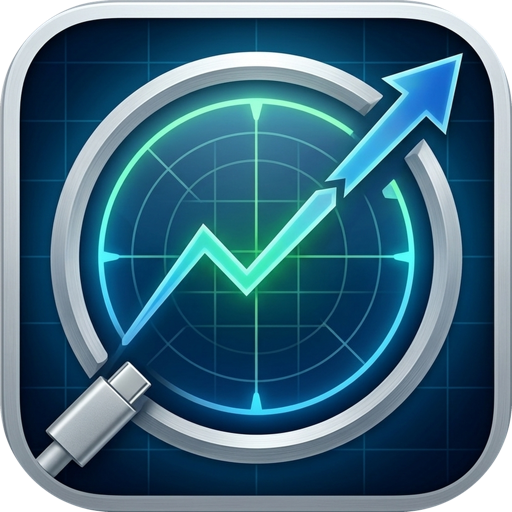

  

# PortScope

**See what your USB-C cables, ports, and docks are actually doing.**

PortScope is a native macOS app for Apple Silicon that reads a USB-C cable's
e-marker and Power Delivery identity through public IOKit APIs, shows every port
and device on your Mac in plain language, and — with a license — measures the
real sustained throughput your cable and drives can carry.

Its whole reason for existing is that three different things get quoted as one
number:

- **What the cable claims** — the spec printed on the e-marker chip.
- **What the link negotiated** — the rate the two ends actually trained.
- **What the Mac measured** — the throughput you really get, right now.

A cable can say "40 Gbps," negotiate 10, and deliver 3 because it's plugged into
a hub's slow port. PortScope keeps those three claims separate and tells you
which one is holding you back.

---

## Highlights

### 🔬 Disk Speed Test that explains *why* a drive slows down

Most disk benchmarks hand you a burst number and stop. PortScope writes and reads
a real file to measure **true sustained** throughput, then keeps analyzing the
curve:

- **Live drive-temperature telemetry** alongside the speed graph — watch the two
  move together.
- **SLC write-cache sizing.** Consumer SSDs absorb writes into a fast pseudo-SLC
  region, then fall off a cliff when it fills. PortScope finds that fold-over and
  reports roughly **how big your drive's fast cache is** and the slower speed
  underneath it.
- **Thermal throttle detection.** It catches the moment a drive slows *because
  it's heating up* — and, crucially, tells that apart from the cache cliff, so
  you know whether the slowdown is a full cache or a hot controller.

That's the analysis a tool like Blackmagic Disk Speed Test doesn't give you: not
just "how fast," but **how long it stays fast, and why it stops.** Every run is
saved with its temperature curve and exportable to CSV.

### 🔗 Two-Mac Cable Tester — test the cable, not the drive

The only honest way to measure a Thunderbolt or USB4 cable's real ceiling is to
take the disk out of the equation. PortScope streams data **memory-to-memory
between two Macs** over the cable under test, so on a Thunderbolt port the
**cable is the only thing that can be the bottleneck** — no SSD, no filesystem,
no enclosure limiting the result. Run it on the cable you *think* is 40 Gbps and
find out what it actually carries.

---

## Download

Grab the latest signed release from the [Releases page][releases], drag
**PortScope** to Applications, and open it. It's a standard Developer
ID–signed, notarized app — no extra tools, no build step.

Buy or manage a license at **[software.fainimade.com][store]**.

## Requirements

- **Apple Silicon** Mac (M1 or later)
- **macOS 15** (Sequoia) or newer

Intel Macs are not supported: their Thunderbolt controllers don't expose cable
identity or PD state through any public API.

---

## What's free, what's paid

Everything PortScope reads and inspects is **free, forever**. The paid tier adds
the tools that actively *test* a cable and a drive, and track them over time.

### Free — Identity & inspection

- **Cable identity.** Decode the e-marker/PD VDOs (SOP/SOP′/SOP″): passive vs.
  active, per-lane speed, maximum current and voltage, vendor and cable ID.
- **Port inventory.** Every physical port — USB-C, HDMI, SD, MagSafe, Ethernet,
  headphone — with the link each one negotiated (USB 3.x gen, USB4/Thunderbolt
  tunnel at 20/40/80 Gbps, DisplayPort alt-mode).
- **Device topology.** A clean "what's actually plugged in" view that folds a
  dock's many internal hubs into one row, or a full detailed chain if you want
  it. Devices are classified by their real USB class codes, not product names.
- **Live data monitor.** Per-device read/write throughput for drives, live
  network bytes for adapters, and DisplayPort lane allocation — all passive,
  no test required.
- **Power, four ways.** Adapter rating vs. cable ceiling vs. negotiated PD
  contract vs. live draw, never conflated, plus each device's requested USB
  current budget.
- **"Why is this slow?"** A one-sentence bottleneck verdict that ranks the
  real causes and names only the binding one — including the dock-slow-port
  case nothing else catches.
- **Dock bandwidth budget.** How a port's link splits between video and data,
  and whether video is stealing from your data lanes or riding its own.
- **Raw data.** USB device/interface descriptors and full EDID 1.4 decode with
  hex dump, for when you need the ground truth.
- **Reference library.** USB and Thunderbolt speed tiers (with every marketing
  rename the same rate has been sold under), the full USB-PD power ladder from
  5 W to 240 W, and a plain-language glossary — with the rows matching your live
  hardware badged.
- **Menu bar quick view.** A live tree of everything connected, grouped by hub,
  with power, throughput, and volume names at a glance.
- **Volumes & drive health.** Mounted volumes, free space, drive temperature and
  NVMe health for internal and Thunderbolt/USB4 NVMe drives.
- **Shareable report.** A one-page Markdown diagnostic, with personal details
  redacted by default, ready to paste into a support thread.

### Paid — Verification & testing

- **Speed Test.** Write then read a real file to measure true sustained
  throughput, with a live curve, drive-temperature telemetry, **SLC
  write-cache sizing**, **thermal-throttle detection**, saved history, and CSV
  export. (See [Highlights](#highlights).)
- **Cable Tester (two-Mac).** Stream data memory-to-memory between two Macs over
  the cable under test, so on a Thunderbolt port the cable is the only thing that
  can be the bottleneck. Requires a license on both Macs. (See
  [Highlights](#highlights).)
- **Cable Health over time.** Track each cable's link-error counters across
  sessions, so a cable that's slowly degrading shows itself before it strands
  you mid-shoot.
- **Wiggle Test.** Flex the cable at each end and along its length while
  PortScope samples link-error counters at 5 Hz, catching an intermittent fault
  the instant it glitches — and localizing it to a connector.
- **Rename Display.** Give a monitor your own name, keyed to its EDID so it
  sticks across replugs, without ever writing to the display.

---

## Licensing

A single PortScope license:

- Activates on **up to two Macs** at once.
- Covers **one full major version, for life** — buy during 1.x and every 1.x
  update is yours forever, with no subscription and no expiry.
- Lets you **deactivate a Mac from Settings** any time, freeing that seat so you
  can license a different machine (the two-install cap always applies).

A future 2.0 is a separate, optional upgrade — 1.x keeps working regardless.

Activation is a lightweight online check with a 14-day offline grace period, so
a flaky connection or an off-grid location never locks you out mid-job.

---

## Privacy

PortScope runs entirely on your Mac. It reads the system's own IORegistry and
hardware telemetry, and nothing about your cables, drives, or machine leaves the
device — the only network calls it ever makes are the license check and an
optional check for app updates. The diagnostic report is a local file you choose
to share, with identifying details redacted by default.

---

© Faini Made. PortScope is a companion to a continuity tester, not a
replacement — it verifies identity and throughput, not pin-level wiring.

[releases]: https://github.com/fainimade/PortScope/releases
[store]: https://software.fainimade.com
